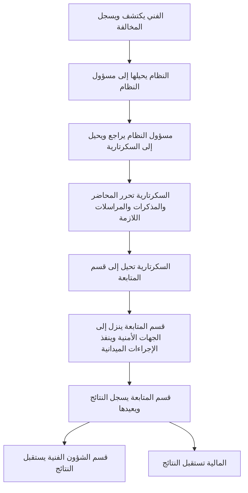

# نافذة المخالفات الميدانية داخل النظام

الحالة: طلب وظيفة إضافية وتصور للمراجعة؛ البرمجة لم تبدأ.

## الشكل

نظام واحد وحسابات دخول موحدة حسب الدور. يظهر للفني قسم «بلاغاتي المسندة» وقسم مستقل «المخالفات الميدانية». تسجيل المخالفة يتم بواسطة الفني عند اكتشافها، بينما بلاغات المواطنين يسجلها المواطن وتوجه لمسؤول القسم بحسب نوعها.

لكل موظف حساب شخصي يجهزه ويوزعه المدير الفني وفق قرار المستخدم. نافذة المخالفات وإجراءاتها داخل واجهة الموظفين المحمية؛ لا يستطيع المشترك أو المستفيد دخولها أو فتح ملفاتها مباشرة. بوابة المواطن منفصلة من حيث الواجهة والصلاحية وتبقى لتقديم البلاغ ومتابعة بلاغاته.

## بيانات المخالفة المطلوبة

- اسم المخالف.
- العنوان التفصيلي والمنطقة.
- كمية المياه المستهلكة التقديرية، مع تحديد الوحدة والفترة لاحقًا.
- نوع النشاط: منزلي، تجاري، حكومي.
- نوع المخالفة ضمن الحالات التي ذكرها المستخدم: ربط عشوائي أو اشتراك مخالف؛ تسمية الخيارات النهائية تعتمد عند تصميم النموذج.

هوية الفني المسجل ووقت التسجيل والرقم المرجعي وسجل الإجراءات تحفظ لتمكين المتابعة؛ تفاصيل العرض تعتمد ضمن مرحلة الوحدة.

## المسار

## الصلاحيات المقترحة

الفني يسجل ويتابع ما سجله، ومسؤول النظام يراجع ويحيل، والسكرتارية تحرر المحاضر والمذكرات والمراسلات وتحيل إلى قسم المتابعة. قسم المتابعة يتولى النزول إلى الجهات الأمنية والإجراءات الميدانية ثم يوثق النتائج ويعيدها إلى الشؤون الفنية والمالية. هاتان الجهتان تستقبلان نتائج المتابعة وفق اختصاصهما. الجهة المخولة بتأكيد السداد وبإغلاق الملف تحتاج تحديدًا عند تنفيذ الوحدة. دور الإدارة العليا للاطلاع على مؤشرات المخالفات يظل مقترحًا يحتاج اعتمادًا، مثل دورها في البلاغات.

عودة نتائج الإجراءات لا تعني إغلاق المخالفة أو اكتمال التسوية تلقائيًا. تحفظ الإحالات والمراسلات ونتائج النزول وسجل الموظفين والتوقيتات لتمكين الجهات المخولة من متابعة المعاملة.

الغرامات تحدد وفق سياسة المؤسسة التي يقدمها المستخدم عند الحاجة؛ لا تحول كمية المياه المقدرة تلقائيًا إلى دين أو غرامة. لا يفترض وجود دفع إلكتروني أو تحصيل داخل الموقع.

## أثر الطلب على المشروع

تظل وحدتا البلاغات والمخالفات في التطبيق نفسه. نافذة المخالفات منفصلة بصريًا وعمليًا عن متابعة المواطن لبلاغه، مع التحكم في الصلاحيات. تضاف مرحلة مستقلة للوحدة بعد الاتفاق على ترتيبها؛ لا يتوسع تنفيذ أي مرحلة جارية تلقائيًا.
