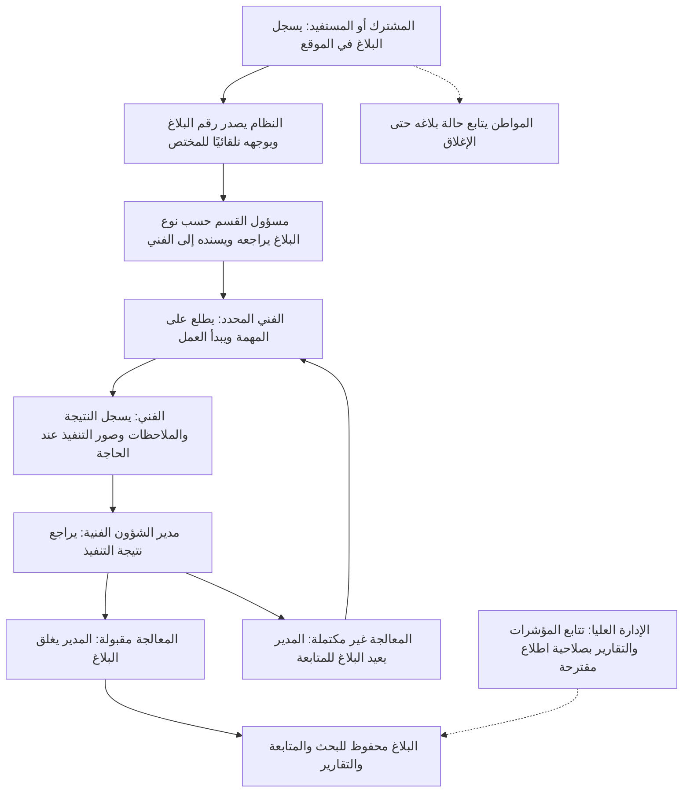
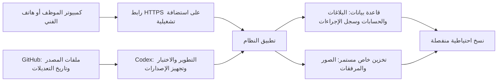

# الشكل النهائي وطريقة تشغيل النظام

الحالة: تصور للمراجعة قبل التنفيذ. المتطلبات الأصلية وتعديلاتها في accepted-updates-ar.md هي المرجع؛ الصلاحيات الجديدة أدناه مقترحة وليست معتمدة تلقائيًا.

## رحلة البلاغ

نتيجة التواصل مع المواطن بعد التنفيذ تسجل اختيارياً ولا تمنع الإغلاق في المتطلبات الحالية. المتابعة متاحة خلال دورة البلاغ، وليست بعد الإغلاق فقط.

## المستخدمون

| الطرف | دوره وواجهته | أساس القرار |
|---|---|---|
| المشترك | يسجل البلاغ بنفسه ويحصل على رقمه ويتابع الحالة | بوابة المواطن معتمدة بتصحيح المستخدم؛ لا يلزم الاشتراك أو العداد لكل بلاغ |
| المستفيد غير المشترك | يمكنه الإبلاغ عن مشكلة مثل تسريب في الشارع مع هاتف ووصف موقع | بيانات الاشتراك اختيارية في المرجع؛ لا يستبعد غير المشترك |
| الموظف الداخلي | يعمل ضمن الصلاحيات الداخلية التي تعتمد لاحقًا | لا يعتمد تسجيل المواطن على الموظف بعد التصحيح؛ اختصاص الموظف في التوجيه يحتاج التحديد |
| الفني، من بين 21 فنيًا | يرى البلاغات المسندة إليه، الموقع والوصف، يبدأ التنفيذ، يسجل المعالجة ويرفع الصور عند الحاجة | معتمد؛ لا يغلق البلاغ نهائيًا |
| مدير الشؤون الفنية | يراجع ويسند ويتابع ويراجع التنفيذ ويغلق أو يعيد، ويتابع أداء الفنيين | معتمد؛ الإغلاق النهائي له وحده |
| الإدارة العليا | لوحة مؤشرات وتقارير، مع الاطلاع على تفاصيل البلاغ وسجل المسؤولية ضمن صلاحياتها | دور اطلاع مقترح استجابة لسؤال المستخدم، يحتاج اعتمادًا؛ لا تضيف الوثيقة الأصلية دورًا صريحًا باسم الإدارة العليا |

قناة الاستقبال المعتمدة: بوابة المواطن ضمن الموقع، لتسجيل البلاغ ومتابعته. النظام يوجهه تلقائيًا إلى مسؤول القسم حسب نوع البلاغ، ثم يسنده المسؤول إلى الفني؛ هذا الاختيار معتمد من المستخدم. لا يفترض تكامل WhatsApp أو إرسال SMS.

## طريقة الدخول والشاشات

يُفتح رابط HTTPS واحد للنظام من الكمبيوتر أو متصفح Android. يدخل كل مستخدم داخلي بحسابه الخاص، وتظهر واجهته بحسب الدور. لا يلزم تثبيت تطبيق Android من متجر. لا يُوعد بالتشغيل دون اتصال؛ الاستخدام التشغيلي بهذا التصور يتطلب اتصالًا بالنظام.

لكل موظف حساب شخصي مستقل يجهزه ويوزعه المدير الفني. المواطن والمشترك لا يملكان صلاحية دخول واجهات الموظفين أو المخالفات الميدانية أو ملفاتها، حتى عبر رابط مباشر. يتحقق النظام من الصلاحيات لكل طلب وعملية، وتظل بوابة المواطن متاحة لتسجيل بلاغه ومتابعته فقط.

تظهر للمواطن واجهة تسجيل بلاغ ومتابعة بلاغه. تضبط آلية إثبات وصوله إلى البلاغ عند تصميم الدخول، ولا يفترض أن الرقم وحده يكفي لعرض البيانات الشخصية.

- الموظف: زر تسجيل بلاغ، قائمة البلاغات، البحث، تفاصيل البلاغ.
- المدير الفني: بلاغات جديدة، بلاغات تحتاج إسنادًا، قيد التنفيذ، بانتظار المراجعة، مغلقة، ومؤشرات التأخر بعد اعتماد مددها.
- الفني: مهامي، تفاصيل المهمة، بدء العمل، تسجيل النتيجة، إرسال للمراجعة.
- الإدارة العليا، إذا اعتمد الدور: لوحة متابعة، تقارير وفلاتر، تفاصيل وسجل ضمن صلاحيات الاطلاع.

صفحة تفاصيل البلاغ تعرض الرقم والحالة وبيانات مقدم البلاغ ونوع المشكلة والموقع والفني المسؤول وتواريخ الإجراءات والملاحظات والصور، بحسب صلاحية المستخدم.

## مكان حفظ النظام

GitHub يحتفظ بملفات البرمجة وتاريخ تعديلها؛ لا تُودع فيه بيانات المواطنين أو كلمات المرور أو الصور التشغيلية. قاعدة البيانات وتخزين الملفات يعملان مع الاستضافة؛ لا يعتمد حفظهما على ملفات مؤقتة قد تُحذف عند إعادة التشغيل. النسخ الاحتياطية تحتاج مكانًا مستقلًا عن النسخة الحية وخطوات استعادة مجربة.

لم تُختَر جهة استضافة بعد، ولم تُتحقَّق حدود المجانية. تُختار خدمة أو خدمات تدعم قاعدة بيانات وتخزينًا مستمرًا وتناسب التكلفة والحماية والاستعادة. يوضح المخطط البنية المطلوبة دون افتراض أن كل مكون مجاني أو مستضاف لدى جهة واحدة.

## تعريف اكتمال المشروع

مواطن يسجل بلاغًا تجريبيًا فيظهر رقمه، النظام يوجهه تلقائيًا إلى المختص وفق القاعدة التي تعتمد، المنفذ يراه في حسابه وينفذ ويرفع النتيجة، المدير يراجع ويغلق أو يعيد. يستطيع المواطن متابعة الحالة. يظهر التاريخ والمسؤولون وتنعكس النتيجة في التقارير. يمكن للمستخدمين المصرح لهم العودة إلى البلاغ بعد تسجيل الخروج وإعادة تشغيل التطبيق. تُتحقق الصلاحيات واستمرار البيانات والنسخ الاحتياطية قبل اعتماد النسخة التشغيلية.

هذا هو المخرج بعد اكتمال المراحل الثماني؛ التنفيذ يظل مرحلة واحدة في كل مرة، مع انتظار اختبار المستخدم واعتماده.
