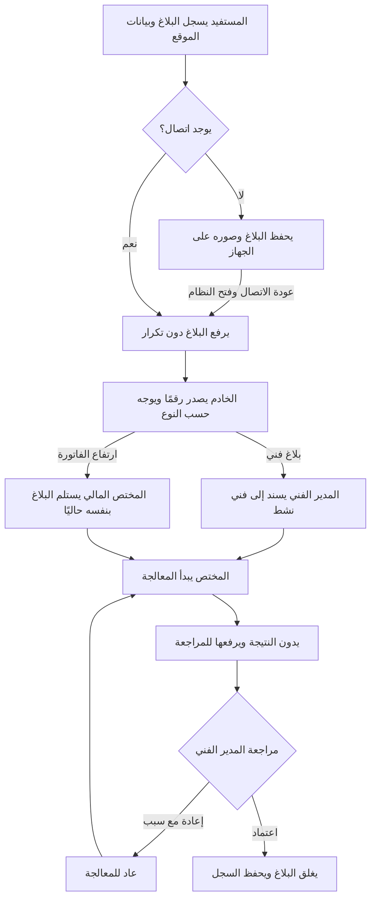
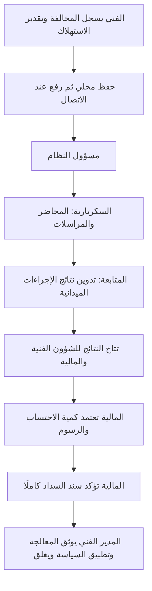

# التحقق من مسار البلاغ حتى الإغلاق — 6 أكتوبر 2026

> **تنبيه الحالة الحالية**

هذا تقرير تاريخي قبل الإصلاح. أُعيد اختبار المسارات بعد إصلاح النتائج والصور دون اتصال والإسناد والحسابات؛ راجع [إصلاحات 7 أكتوبر](review-fixes-2026-10-07-ar.md).

النتيجة: نجح المسار المتصل بالإنترنت على سبعة بلاغات جديدة، واحد لكل نوع معتمد، وعلى ثلاث مخالفات جديدة للمنزلي والتجاري والحكومي. نجحت متابعة المستفيد في كل حالة، وإعادة البلاغ الفني والمالي للمعالجة ثم إغلاقهما. توجد فجوات متبقية في الإسناد المالي والعمل الميداني يجب تمييزها عن نجاح هذه التجربة.

لم تُعدل وظائف النظام أو بيانات النسخة التجريبية. أنشأ الاختبار نسخة منفصلة وقاعدة PostgreSQL خاصة، ونُظفت بياناتها بعد الفحص. سجلات اللجنة القديمة لم تُستخدم لإثبات إنشاء جديد أو تُعد إلى حالتها الأولية.

## بلاغات المستفيدين

المستفيد يتابع حالته وقسمه وتواريخ الإجراءات خلال المسار؛ لا تظهر له ملاحظات الموظفين الداخلية. لا يمنحه رقم البلاغ وحده الوصول إلى بلاغ شخص آخر أو واجهة الموظفين.

| النوع الذي أُنشئ من الواجهة | التوجيه الحالي | نتيجة التجربة |
|---|---|---|
| عدم وصول الماء | الشؤون الفنية | أُغلق بواسطة المدير الفني |
| تسريب أو انكسار | الشؤون الفنية | أُعيد للمعالجة ثم أُغلق |
| ربط مخالف أبلغ عنه مستفيد | الشؤون الفنية | أُغلق كبلاغ مستفيد |
| تغير طعم أو لون الماء | الشؤون الفنية | أُغلق بواسطة المدير الفني |
| ارتفاع الفاتورة | القسم المالي | استلمه موظف مالي، ثم أُعيد للمعالجة وأُغلق |
| ضعف الماء | الشؤون الفنية | أُغلق بواسطة المدير الفني |
| أخرى، مع وصف النوع | الشؤون الفنية | أُغلق بواسطة المدير الفني |

سُجلت حالة المستفيد بعد كل إجراء، وليس في النهاية فقط: الاستلام، الإسناد، المعالجة، المراجعة، الإعادة عند الحاجة، ثم الإغلاق. بقي البلاغ المغلق قابلًا للبحث برقم البلاغ وتصفية الحالة. فُحصت سجلات القاعدة مستقلة عن الشاشة: ترتيب الإجراءات، الفاعل، الزمن المتتابع، إغلاق المدير الفني، ووحدة السجل لكل معرف إرسال.

رفعت تجربة التسريب صورة مع البلاغ: حُفظت دون اتصال، وأعيد فتح الصفحة، ثم رفعت عند عودة الاتصال. هذه صورة إدخال أولي، ولا تمثل صورة تنفيذ الفني بعد الإصلاح.

## المخالفات الميدانية

اختُبر المسار على مخالفة منزلية وأخرى تجارية وثالثة حكومية من التسجيل الفعلي في نموذج الفني حتى الإغلاق. أُنشئت وأُصدرت مذكرة خيالية من السكرتارية في التجربة المنزلية؛ استُخدمت مراجع مراسلات خيالية في التجربتين الأخريين. لا تُرسل هذه المستندات إلى جهة خارجية، والاختبار لا يمثل نزولًا أمنيًا أو دفعًا حقيقيًا؛ يثبت التسجيل والإحالة والصلاحيات داخل النظام.

كان تقدير الفني99.99مترًا مكعبًا، بينما اعتمدت المالية10.5متر مكعب بصورة مستقلة. تأكدت القاعدة من حفظ القيمتين وعدم احتساب الغرامة تلقائيًا من تقدير الفني:

| النشاط | الرسم الثابت | سعر المتر المكعب | الكمية المعتمدة | المستحق والسداد التجريبي |
|---|---:|---:|---:|---:|
| منزلي |225,000|300|10.5|228,150 ريال |
| تجاري |325,000|400|10.5|329,200 ريال |
| حكومي |325,000|400|10.5|329,200 ريال |

أكدت المالية الدفع في الحالات الثلاث، ولم يغلق الملف تلقائيًا بمجرد السداد. أغلق المدير الفني بعد تدوين المعالجة وتأكيد تطبيق سياسة المؤسسة. حُفظت أحداث الاستلام والإحالات وعودة النتائج والاعتماد والسداد والإغلاق، مع هوية أصحاب الإجراءات.

## منع تجاوز المسار

اختُبرت70محاولة فعلية عبر HTTP؛47رُفضت بالصلاحيات403، و23رُفضت لعدم اكتمال البيانات400. شملت:

- محاولة المستفيد إسناد بلاغه، ومحاولة المدير إغلاقه قبل اكتمال المعالجة.
- إرسال النتيجة قبل بدء العمل، ومحاولة الفني أو موظف المالية إغلاق بلاغ المستفيد.
- إرسال نتيجة فارغة أو إعادة بلا سبب؛ لم تُغيّر هذه المحاولات الحالة.
- إغلاق البلاغ مرة أخرى بعد الإغلاق؛ بقي حدث إغلاق واحد.
- تجاوز السكرتارية في إحالة المخالفة، أو الإحالة للمتابعة بلا جهة ومرجع.
- محاولة المدير تأكيد دفع، أو المالية إغلاق مخالفة، أو المدير إغلاقها قبل الدفع.
- دفع مبلغ لا يساوي المستحق، والإغلاق دون تأكيد استكمال السياسة.

نجحت أيضًا56اختبارًا من مجموعات Django الأصلية الخاصة بالإدخال وسجل البلاغ والإجراءات والمخالفات والتسوية والمستندات. تشمل وصول مستفيد آخر، وفني غير مسند، وموظف مالي آخر، وCSRF، وثبات الأدلة المالية عند إعادة الطلب، والإرسال المتزامن دون تكرار. هذه اختبارات إضافية إلى تجربة المتصفح، وليست56بلاغًا جديدًا أُغلق من الواجهة.

## ما لم يكتمل مطابقًا للمطلوب

1. **الإسناد المالي مؤقت:** قاعدة النوع ترسل ارتفاع الفاتورة إلى المالية، ثم يختار موظف مالي استلامه بنفسه. لا يوجد حاليًا مسؤول قسم مالي يوزع البلاغات على المختصين، ولا خريطة مؤسسية قابلة للضبط لكل نوع ومسؤوله. المتطلب المعتمد «إلى مسؤول القسم ثم يسنده» منفذ في الفرع الفني بواسطة المدير الفني؛ لم يُنفذ بصورة كاملة للفواتير والاشتراكات. المصدر: `portal/complaints.py:102` و`portal/workflow.py:44`. التقسيم المؤقت موثق سابقًا في `stage-4-5-ar.md`، ولا يُعد اعتمادًا لخريطة المؤسسة النهائية.
2. **العمل بلا اتصال يغطي التسجيل الأولي حاليًا:** نجحت إعادة فتح بلاغ بصورته ومخالفة عند الانقطاع ثم رفعهما دون تكرار. نتيجة تنفيذ الفني وإجراءات الإحالة والمراجعة والإغلاق تحتاج اتصالًا؛ نتيجة الفني لا تملك مسار حفظ محلي ومزامنة. دليل فقد النتيجة في المراجعة السابقة `review-2026-10-06-ar.md`، ولم يُصلح في هذه المهمة.
3. **صور ما بعد الإصلاح غير منفذة:** المرفقات التي نجحت هنا صور إدخال المستفيد؛ لا توجد مرفقات مستقلة لنتيجة تنفيذ الفني. هذا النقص باقٍ من المراجعة السابقة.
4. **إعادة الإسناد أثناء العمل غير متاحة:** نجحت إعادة المدير للمعالجة من حالة المراجعة، لكنها تختلف عن تبديل الفني لبلاغ مسند أو قيد التنفيذ عند غيابه. القيد السابق لا يزال قائمًا.

بلاغ المستفيد عن ربط مخالف يظل ضمن دورة بلاغات المستفيد؛ مخالفة الفني ملف مستقل له المراسلات والرسوم. لم يُنفذ تحويل تلقائي بينهما، ولم يُفترض أنه مطلوب أو أن بلاغ مستفيد يثبت مخالفة قابلة للغرامة تلقائيًا.

## الأدلة وحدود الاختبار

- `test-results/workflow-path-review/browser-results.json`: البلاغات والمخالفات الجديدة، حالات المتابعة، الأحداث المحفوظة، والطلبات المرفوضة.
- `test-results/workflow-path-review/django-tests.log`: نجاح56اختبارًا في قاعدة اختبار مؤقتة.
- `test-results/workflow-path-review/beneficiary-closed.png`: متابعة المستفيد بعد الإغلاق.
- `test-results/workflow-path-review/complaint-complete-history.png`: سجل البلاغ الفني، بما فيه الإعادة للمعالجة.
- `test-results/workflow-path-review/violation-complete-history.png`: المسار المالي والإغلاق للمخالفة الحكومية.

لإعادة التحقق في البيئة السحابية Linux: `.venv/bin/python scripts/workflow_path_review.py`؛ يشغّل `scripts/workflow_path_browser_checks.py` على نسخة اختبار معزولة ويتحقق من النتائج المحفوظة ويشغل مجموعات Django المذكورة. الانتظار في اختبار المتصفح يفحص القيمة المحسومة فعلًا من IndexedDB قبل المتابعة، وليس مجرد بدء وعد JavaScript غير مكتمل.

التنفيذ الحالي لهذه المراجعة استعمل PostgreSQL الحقيقي ومشغّل النسخة المحمولة وWaitress في Linux، وChromium بعرض هاتف. لم يختبر جهاز Windows أو هاتفAndroid فعليًا، أو تعامل الموظفين المتزامن تحت حمل المؤسسة. لا يصح تحويل نجاح المسار المتصل إلى قول إن كل العمل بلا اتصال مكتمل أو أن العيوب التشغيلية في `review-windows-portable-2026-10-06-ar.md` أُصلحت.