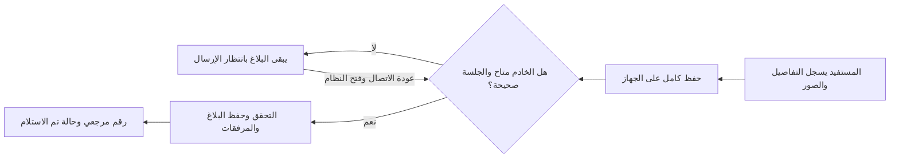

# تجربة المرحلة الثانية: تسجيل بلاغ المستفيد

أذن المستخدم بالانتقال بعد مراجعة واجهات المرحلة الأولى بقوله «انطلق». تركز هذه المرحلة على تسجيل البلاغ الكامل وحفظ بياناته وصوره ومزامنته، مع الاحتفاظ بالحسابات ومسودات المرحلة الأولى.

## ما أصبح متاحًا

- تسجيل البلاغ من مساحة حساب المستفيد، بالأنواع السبعة والأحياء الـ37 المعتمدة. اختيار «أخرى» يفتح خانة التفاصيل المطلوبة.
- اسم مقدم البلاغ وهاتفه، رقم الاشتراك والعداد الاختياريان، الموقع بالتفصيل، المعلم القريب ووصف المشكلة.
- الموقع الجغرافي اختياري، ويطلب إذن المتصفح عند الضغط على زر إضافته فقط. يجب استخدامه أثناء الوجود في موقع المشكلة. عدم السماح به لا يمنع التسجيل.
- حتى ثلاث صور اختيارية بصيغ JPEG أو PNG أو WebP، لا تتجاوز الصورة 5 ميجابايت. هذه حدود تقنية لهذه النسخة، وليست سياسة للمؤسسة.
- حفظ النموذج والصور معًا على الجهاز عند الضغط على «حفظ البلاغ وإرساله»، قبل محاولة الاتصال بالخادم.
- حالة محلية واضحة أثناء انتظار الاتصال. لا يعرض رقمًا مرجعيًا قبل إقرار الخادم.
- رقم مرجعي يبدأ بـ`MRB-` وحالة «تم الاستلام» عندما يصل البلاغ إلى PostgreSQL ويكتمل حفظ مرفقاته.
- إيصالات استلام خاصة بالحساب؛ آخر 20 إيصالًا من الخادم، يعرض سجل الجهاز ما ينتظر الإرسال أو يحتاج تصحيحًا أثناء الاتصال، ويعرض إيصالاته المحلية أيضًا عند الانقطاع، لتجنب تكرار الإيصال نفسه في قسمين. البحث وسجل التفاصيل يأتيان في المرحلة الثالثة.
- الاحتفاظ ببلاغات فشلت في التحقق على الجهاز، وإعادة بياناتها وصورها إلى النموذج لتصحيحها. يحذف السجل المرفوض محليًا فقط بعد نجاح حفظ نسخته المصححة على الجهاز.
- المسودات الأولية السابقة متاحة داخل قسم قابل للفتح أسفل مساحة المستفيد، ولم تُحوّل تلقائيًا إلى بلاغات رسمية. يحتفظ الموظفون بدفتر المسودات الميدانية حتى تنفيذ وحدة المخالفات.

## خطوات التجربة عند إتاحة التشغيل التفاعلي

1. سجل الدخول بحساب مستفيد جهز سابقًا بوجود الإنترنت. افتح مساحتك وانتظر تجهيزها.
2. اختر نوع البلاغ والحي، واكتب العنوان والمعلم والوصف. اترك الاشتراك والعداد فارغين إذا لم يوجدا.
3. جرّب «أخرى» وتأكد من طلب التفاصيل. جرّب الموقع بإذن المتصفح، أو أكمل بدونه.
4. أرفق صورة تجريبية، ثم اقطع الاتصال واضغط «حفظ البلاغ وإرساله».
5. تحقق من ظهور البلاغ والصورة بحالة «محفوظ على الجهاز · بانتظار الإرسال» دون رقم بلاغ.
6. أغلق المتصفح وافتحه على الجهاز نفسه؛ يجب أن يبقى السجل والصورة موجودين.
7. عند الوصول إلى اتصال مودم، افتح النظام. بعد تأكيد الاستلام يظهر الرقم المرجعي والحالة «تم الاستلام».
8. أعد المزامنة؛ يجب أن يبقى البلاغ مرة واحدة وبالرقم نفسه.
9. جرّب حسابًا آخر؛ لا يرى إيصالات الحساب السابق أو صوره. إذا انتهت الجلسة، ادخل مجددًا عند توفر الشبكة لإرسال ما حفظته.

استخدم أسماء وصورًا وبيانات خيالية أثناء الاختبار. لا توجد حسابات فعلية جاهزة أو كلمات مرور ثابتة.

## حدود هذه المرحلة

التوجيه إلى الأقسام، المراجعة، إسناد الفني، التنفيذ، الإغلاق، البحث والتقارير ودورة المخالفات لم تُفعّل بعد. «تم الاستلام» تثبت تسجيل البلاغ ولا تعني إحالته أو بدء معالجته. تحديد جهات ومسؤولي الفواتير والاشتراكات يأتي عند تنفيذ التوجيه.

أول فتح ودخول يحتاجان اتصالًا. المزامنة والمتصفح مغلق تعتمد على دعمه؛ افتح النظام عند عودة الاتصال لضمان المحاولة. حذف بيانات المتصفح أو فقد الجهاز قد يفقد بياناته غير المرسلة. حفظ النموذج يحدث عند الضغط على زر الحفظ، ولا يشمل كتابة غير محفوظة.

النسخة تعمل داخل بيئة Codex ولم تنشر على رابط عام. صور الاختبار على Chromium بأحجام هاتف لا تعني اختبارًا على Android فعليًا أو قبولًا مؤسسيًا. اعتماد هذه المرحلة مطلوب قبل الانتقال إلى المرحلة التالية، وفق أسلوب العمل الذي طلبه المستخدم.

## مكان حفظ البيانات

المعلومات الرسمية في PostgreSQL، والصور في تخزين ملفات خاص يحدده `WASH_MEDIA_ROOT`، وافتراضيًا مجلد `media/` داخل المشروع المستثنى من Git. تصل الصور إلى صاحب الحساب عبر نقطة وصول تتحقق من دخوله وملكية البلاغ؛ لا يوجد مسار ملفات عام.

النسخة المحلية غير المرسلة والصور في IndexedDB داخل المتصفح على جهاز المستفيد، مفصولة بحسب الحساب. لا تحفظ كلمات المرور أو رموز CSRF في تلك القاعدة أو ذاكرة الواجهة. عند التشغيل المؤسسي يجب حفظ قاعدة البيانات ومجلد الصور بنسخ احتياطية متوافقة وتأمين تخزين مستمر، ويمكن تبديل خلفية تخزين Django عند الحاجة.
